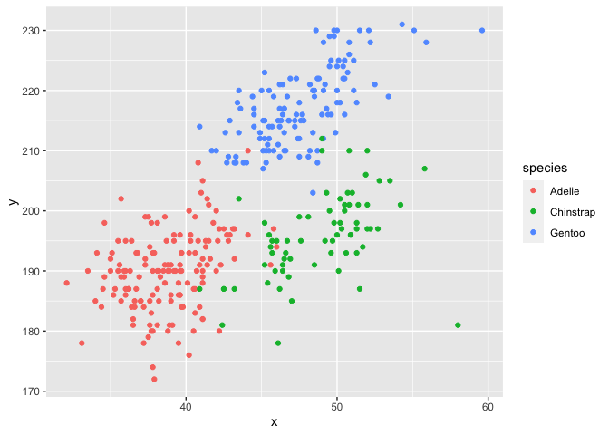

Homework1
================
Meiju Chen
9/19/2020

This is my solution to HW1.

``` r
library(tidyverse)
```

    ## ── Attaching packages ─────────────────────────────────────────── tidyverse 1.3.0 ──

    ## ✓ ggplot2 3.3.2     ✓ purrr   0.3.4
    ## ✓ tibble  3.0.3     ✓ dplyr   1.0.2
    ## ✓ tidyr   1.1.2     ✓ stringr 1.4.0
    ## ✓ readr   1.3.1     ✓ forcats 0.5.0

    ## ── Conflicts ────────────────────────────────────────────── tidyverse_conflicts() ──
    ## x dplyr::filter() masks stats::filter()
    ## x dplyr::lag()    masks stats::lag()

## Problem 1

Create a data frame with the specified elements.

``` r
prob1_df = 
  tibble(
    samp = rnorm(10),
    samp_gt_0 = samp > 0,
    char_vec = c("a", "b", "c", "d", "e", "f", "g", "h", "i", "j"),
    factor_vec = factor(c("low", "low", "low", "mod", "mod", "mod", "mod", "high", "high", "high" ))
  )
```

Take the mean of each variable in my data frame.

``` r
mean(pull(prob1_df, samp))
```

    ## [1] 0.09910876

``` r
mean(pull(prob1_df, samp_gt_0))
```

    ## [1] 0.6

``` r
mean(pull(prob1_df, char_vec))
```

    ## Warning in mean.default(pull(prob1_df, char_vec)): argument is not numeric or
    ## logical: returning NA

    ## [1] NA

``` r
mean(pull(prob1_df, factor_vec))
```

    ## Warning in mean.default(pull(prob1_df, factor_vec)): argument is not numeric or
    ## logical: returning NA

    ## [1] NA

I can take the mean of numbers and logical but not character or factor.

``` r
as.numeric(pull(prob1_df, samp))
```

    ##  [1]  1.07619608  0.63881321  0.20714996 -1.10430006 -1.03237124  1.48735895
    ##  [7] -0.35184436  1.01297172  0.05382968 -0.99671632

``` r
as.numeric(pull(prob1_df, samp_gt_0))
```

    ##  [1] 1 1 1 0 0 1 0 1 1 0

``` r
as.numeric(pull(prob1_df, char_vec))
```

    ## Warning: NAs introduced by coercion

    ##  [1] NA NA NA NA NA NA NA NA NA NA

``` r
as.numeric(pull(prob1_df, factor_vec))
```

    ##  [1] 2 2 2 3 3 3 3 1 1 1

``` r
as.numeric(pull(prob1_df, samp_gt_0)) * pull(prob1_df, samp)
```

    ##  [1] 1.07619608 0.63881321 0.20714996 0.00000000 0.00000000 1.48735895
    ##  [7] 0.00000000 1.01297172 0.05382968 0.00000000

``` r
as.numeric(pull(prob1_df, factor_vec)) * pull(prob1_df, samp)
```

    ##  [1]  2.15239216  1.27762643  0.41429991 -3.31290019 -3.09711372  4.46207685
    ##  [7] -1.05553309  1.01297172  0.05382968 -0.99671632

## Problem 2

After install the package, load the penguins dataset.

``` r
data("penguins", package = "palmerpenguins")
```

Below is a short description of the penguins dataset.

1.  The size of the dataset: 344 rows and 8 columns.
2.  Three species: ‘Adelie’, ‘Chinstrap’, ‘Gentoo’
3.  Three locations: ‘Biscoe’, ‘Dream’, ‘Torgersen’
4.  The mean of bill length: 43.9219298
5.  The mean of bill depth: 17.1511696
6.  The mean of flipper length: 200.9152047

This is a scatterplot of flipper\_length\_mm (y) vs bill\_length\_mm
(x).

``` r
plot_df = 
  tibble(
    x = pull(penguins, bill_length_mm),
    y = pull(penguins, flipper_length_mm),
    species = pull(penguins, species)
  )

ggplot(plot_df, aes(x = x, y = y, color = species)) + geom_point()
```

    ## Warning: Removed 2 rows containing missing values (geom_point).

<!-- -->

``` r
ggsave("scatter_plot.pdf")
```

    ## Saving 7 x 5 in image

    ## Warning: Removed 2 rows containing missing values (geom_point).
